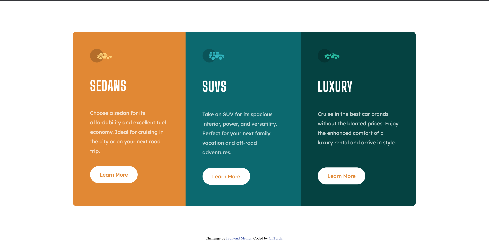

# Frontend Mentor - 3-column preview card component solution

This is a solution to the [3-column preview card component challenge on Frontend Mentor](https://www.frontendmentor.io/challenges/3column-preview-card-component-pH92eAR2-). Frontend Mentor challenges help you improve your coding skills by building realistic projects. 

## Table of contents

- [Overview](#overview)
  - [The challenge](#the-challenge)
  - [Screenshot](#screenshot)
  - [Links](#links)
- [My process](#my-process)
  - [Built with](#built-with)
  - [What I learned](#what-i-learned)
  - [Continued development](#continued-development)
  - [Useful resources](#useful-resources)
- [Author](#author)
- [Acknowledgments](#acknowledgments)

**Note: Delete this note and update the table of contents based on what sections you keep.**

## Overview
This is my Solution to the 'newbie' level challenge title: 

3 column preview cards component

### The challenge

Users should be able to:

- View the optimal layout depending on their device's screen size
- See hover states for interactive elements

### Screenshot

### Links

- Solution URL: [https://github.com/GilTorch/frontend-mentor-challenges](https://github.com/GilTorch/frontend-mentor-challenges)
- Live Site URL: [https://giltorch.github.io/](https://https://giltorch.github.io/)

## My process

### Built with

- Semantic HTML5 markup
- Flexbox
- Mobile-first workflow

### What I learned

This project was very simple but while doing it I reflected 
on challenges I had while building something similar in a past project. I had an issue with the buttons not aligning because of
the paragraph being of different lengths for each column and I found that adding a height to the paragraph solves that.

### Continued development

In my future learnings, I'd like to focus on layouts.

### Useful resources

I didn't use a lot of resources for this except [W3 Schools](https://www.w3schools.com/) when I want to be sure I am using a tag or a css property the right way.

## Author

- Frontend Mentor - [@GilTorch](https://www.frontendmentor.io/profile/GilTorch)
- Twitter - [@TorchonGilbert](https://twitter.com/TorchonGilbert)

